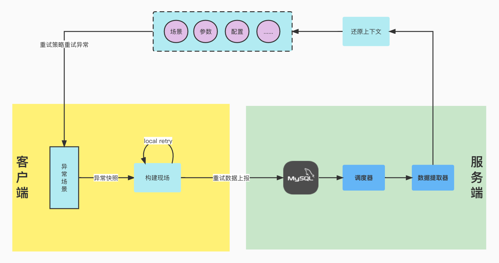
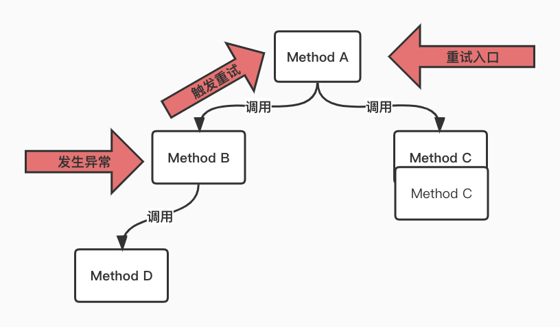
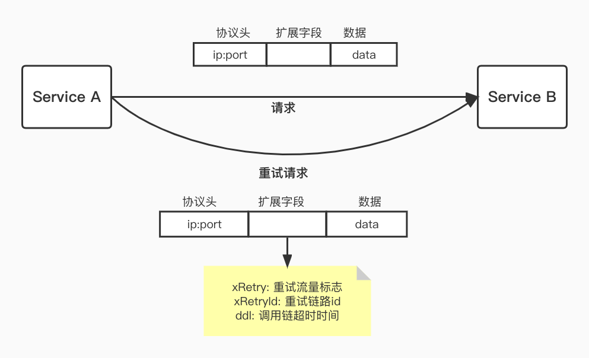

#### 客户端与服务端数据交互图

> 客户端核心能力
- 负责发现异常，标记事故现场
- 根据不同阶段进行本地重试和远程重试
- 失败上报和执行服务端下发的重试指令
- 避免服务间调用产生重试放大风险
- 重试流量管控
    - 单机多注解循环引用问题
    - 标记重试流量
    - 调用链超时控制(Deadline Request)
    - 特殊的 status code 限制链路重试

> 服务端核心能力
- 收集上报信息，统一预警
- 通过组协调器为不同的POD分配需要调度的Group信息
- 管理死信队列和重试数据状态以及触发时间
- 支持配置中心可视化

#### 系统架构图

[comment]: <> (![系统架构图-v1.0.jpg]&#40;../../.vuepress/public/img/系统架构图-v1.0.jpg&#41;)

### 客户端剖析
#### 重试流量管控
> 单机重试管控

单机多注解嵌套方法,通过标记重试现场入口，发生异常重试只重试现场入口，防止每个方法都重试, 从而避免了重试风暴

> 链路重试管控

- 特殊的status code限制链路重试: 让被调用方有反抗的权利(统一约定一个特殊的 status code
  它表示：调用失败，但别重试)
- 调用链超时控制(Deadline Request): 当剩余时间不够时不再发起重试请求
- 特殊的retry flag 保障重试请求不重试: 通请求头传递retry flag 保障即使发生异常也不重试

> 重试流速管控

通过路由策略和限流措施对每个组的集群进行流量控制

#### 支持多种退避策略
- 线性退避: 每次等待固定时间后重试
- 随机退避: 在一定范围内随机等待一个时间后重试
- 延迟等级退避: 依据延迟等级, 等待每个延迟等级设置的时间, 延迟等级枚举 `DelayLevelEnum`
- Cron表达式退避: 使用Cron表达式计算重试触发时间

#### 客户端功能模块图

[comment]: <> (![客户端功能模块-v1.0.jpg]&#40;../../.vuepress/public/img/客户端功能模块-v1.0.jpg&#41;)

- 启动模块
    - 滑动窗口模块: 监听需要上报的数据
    - Netty启动器: 启动客户端Netty组件，建立与服务端心跳机制
    - 远程配置获取器: 获取最新版本的配置信息
    - 注解扫描模块: 负责扫描添加到方法上的@Retryable注解，获取参数信息、类信息、方法路径等；解析注解元数据信息，构建执行器

- 重试阶段
    - 重试模式
        - 本地重试: 当发生异常时候, 若注解上的配置`RetryType.ONLY_LOCAL`或者`RetryType.LOCAL_REMOTE`, 则会触发本地内存重试
        - 远程重试: 本地重试没有成功，若注解上的配置`RetryType.ONLY_REMOTE`或者`RetryType.LOCAL_REMOTE`, 则会触发上报服务端重试

    - 执行器
        - 重试组件: 对guava retry 的深度封装
        - 重试执行器
            - 类反射执行器: 即重试执行原方法
            - 自定义方法执行器: 用户通过实现`RetryMethod`接口, 即可实现自定义重试, 发生重试时直接重试自定义方法执行器
- 重试流量管控
    - 单机多注解循环引用问题
  > 标记重试入口,触发重试时只从标记的重试入口进入

  

    - 标记重试流量
      > 对于重试的请求，我们在请求头中下发一个特殊的标识(xRetry:boolean),
      在 Service A ->Service B ->Service C 的调用链路中，当Service B 收到Service A 的请求时会先读取这个 xRetry 判断这个请求是不是重试请求，
      如果是，那它调用Service C 即使失败也不会重试；否则将触发重试 。
      同时Service B 也会把这个 xRetry 下传，它发出的请求也会有这个标志，它的下游也不会再对这个请求重试

      

    - 调用链超时控制(Deadline Request)
      > DDL 是“ Deadline Request 调用链超时”的简称，我们知道 TCP/IP 协议中的 TTL 用于判断数据包在网络中的时间是否太长而应被丢弃，DDL 与之类似，
      它是一种全链路式的调用超时，可以用来判断当前的 RPC 请求是否还需要继续下去。如下图，在 RPC 请求调用链中会带上超时时间，
      并且每经过一层就减去该层处理的时间，如果剩下的时间已经小于等于 0 ，则可以不需要再请求下游，直接返回失败即可。
      

    - 特殊的 status code 限制链路重试
      > 如果每层都配置重试可能导致调用量指数级扩大，这样对底层服务来说压力是非常之大的, 通过对流量的标记
      ，用户可以判断是否是重试的流量来判断是否继续处理，我们使用 Google SRE 中提出的内部使用特殊错误码的方式来实现：

          1 统一约定一个特殊的 status code ，它表示：调用失败，但别重试。
          2 任何一级重试失败后，生成该 status code 并返回给上层。
          3 上层收到该 status code 后停止对这个下游的重试，并将错误码再传给自己的上层。

      > 这种方式理想情况下只有最下一层发生重试，它的上游收到错误码后都不会重试，但是这种策略依赖于业务方传递错误码，
      对业务代码有一定入侵，而且通常业务方的代码差异很大， 调用 RPC 的方式和场景也各不相同，需要业务方配合进行大量改造，
      很可能因为漏改等原因导致没有把从下游拿到的错误码传递给上游。

      
  
